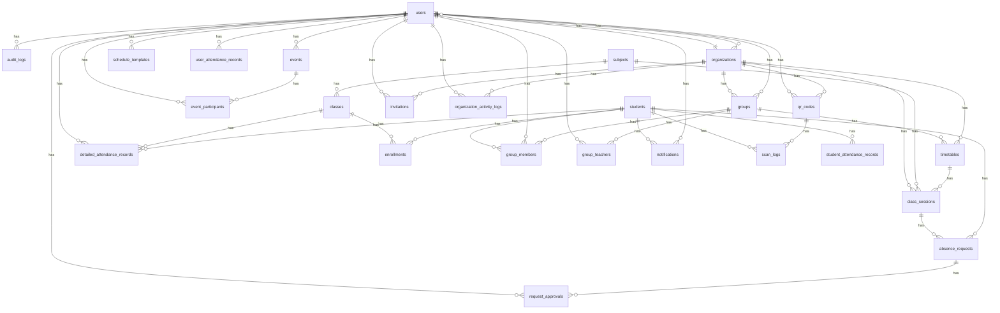

# Database Schema

Generated: 2026/1/13 11:30:43

## Database: sotsuken

Total Tables: 32

## Table Summary

| Table | Rows | Description |
|-------|------|-------------|
| absence_requests | 21 | |
| allowed_ip_ranges | 3 | |
| audit_logs | 0 | |
| class_sessions | 0 | |
| classes | 5 | |
| detailed_attendance_records | 0 | |
| enrollments | 8 | |
| event_participants | 0 | |
| events | 0 | |
| group_members | 2 | |
| group_teachers | 0 | |
| groups | 4 | |
| invitations | 0 | |
| migrations | 5 | |
| notifications | 4 | |
| organization_activity_logs | 0 | |
| organization_settings | 1 | |
| organization_time_slots | 1 | |
| organizations | 14 | |
| qr_codes | 0 | |
| request_approvals | 0 | |
| scan_logs | 0 | |
| schedule_templates | 0 | |
| schema_migrations | 1 | |
| student_attendance_records | 13 | |
| students | 13 | |
| subjects | 5 | |
| system_settings | 5 | |
| timetables | 0 | |
| user_attendance_records | 0 | |
| users | 4 | |
| v_organization_summary | 14 | |

## ER Diagram

## Table Details

### absence_requests

Rows: 21

| Column | Type | Key | Null | FK Reference |
|--------|------|-----|------|-------------|
| id | int | PK | NO |  |
| student_id | varchar(255) | FK | NO | students.student_id |
| class_session_id | int | FK | YES | class_sessions.id |
| request_type | varchar(50) | FK | NO |  |
| request_date | date | FK | NO |  |
| reason | text |  | NO |  |
| attachment_url | varchar(500) |  | YES |  |
| status | enum('pending','approved','rejected') | FK | YES |  |
| submitted_at | timestamp |  | YES |  |
| updated_at | timestamp |  | YES |  |

### allowed_ip_ranges

Rows: 3

| Column | Type | Key | Null | FK Reference |
|--------|------|-----|------|-------------|
| id | int | PK | NO |  |
| name | varchar(255) |  | NO |  |
| ip_start | varchar(45) |  | NO |  |
| ip_end | varchar(45) |  | NO |  |
| description | text |  | YES |  |
| is_active | tinyint(1) | FK | YES |  |
| created_at | timestamp |  | YES |  |
| updated_at | timestamp |  | YES |  |

### audit_logs

Rows: 0

| Column | Type | Key | Null | FK Reference |
|--------|------|-----|------|-------------|
| id | int | PK | NO |  |
| user_id | int | FK | YES | users.id |
| action | varchar(100) |  | NO |  |
| table_name | varchar(100) | FK | NO |  |
| record_id | varchar(100) |  | YES |  |
| old_values | json |  | YES |  |
| new_values | json |  | YES |  |
| ip_address | varchar(45) |  | YES |  |
| user_agent | text |  | YES |  |
| created_at | timestamp | FK | YES |  |

### class_sessions

Rows: 0

| Column | Type | Key | Null | FK Reference |
|--------|------|-----|------|-------------|
| id | int | PK | NO |  |
| timetable_id | int | FK | NO | timetables.id |
| subject_id | int | FK | NO | subjects.id |
| class_date | date | FK | NO |  |
| period_number | int | FK | NO |  |
| start_time | time |  | NO |  |
| end_time | time |  | NO |  |
| room | varchar(100) |  | YES |  |
| teacher_name | varchar(255) |  | YES |  |
| is_cancelled | tinyint(1) | FK | YES |  |
| cancellation_reason | text |  | YES |  |
| notes | text |  | YES |  |
| created_at | timestamp |  | YES |  |
| updated_at | timestamp |  | YES |  |
| organization_id | int | FK | NO | organizations.id |

### classes

Rows: 5

| Column | Type | Key | Null | FK Reference |
|--------|------|-----|------|-------------|
| id | int | PK | NO |  |
| class_code | varchar(50) |  | NO |  |
| subject_id | int | FK | NO | subjects.id |
| teacher_name | varchar(255) |  | NO |  |
| room | varchar(100) |  | YES |  |
| schedule_day | enum('monday','tuesday','wednesday','thursday','friday','saturday','sunday') | FK | NO |  |
| start_time | time |  | NO |  |
| end_time | time |  | NO |  |
| semester | varchar(20) | FK | YES |  |
| academic_year | varchar(10) |  | YES |  |
| is_active | tinyint(1) |  | YES |  |
| created_at | timestamp |  | YES |  |
| updated_at | timestamp |  | YES |  |

### detailed_attendance_records

Rows: 0

| Column | Type | Key | Null | FK Reference |
|--------|------|-----|------|-------------|
| id | int | PK | NO |  |
| student_id | varchar(255) | FK | NO | students.student_id |
| class_id | int | FK | NO | classes.id |
| attendance_date | date | FK | NO |  |
| status | enum('present','absent','late','excused') |  | NO |  |
| check_in_time | datetime |  | YES |  |
| check_out_time | datetime |  | YES |  |
| notes | text |  | YES |  |
| created_by | int | FK | YES | users.id |
| created_at | timestamp |  | YES |  |
| updated_at | timestamp |  | YES |  |

### enrollments

Rows: 8

| Column | Type | Key | Null | FK Reference |
|--------|------|-----|------|-------------|
| id | int | PK | NO |  |
| student_id | varchar(255) | FK | NO | students.student_id |
| class_id | int | FK | NO | classes.id |
| enrollment_date | date |  | NO |  |
| status | enum('enrolled','dropped','completed') |  | YES |  |
| grade | varchar(5) |  | YES |  |
| created_at | timestamp |  | YES |  |
| updated_at | timestamp |  | YES |  |

### event_participants

Rows: 0

| Column | Type | Key | Null | FK Reference |
|--------|------|-----|------|-------------|
| id | int | PK | NO |  |
| event_id | int | FK | NO | events.id |
| user_id | int | FK | NO | users.id |
| status | enum('pending','accepted','declined') | FK | YES |  |
| created_at | timestamp |  | YES |  |
| updated_at | timestamp |  | YES |  |

### events

Rows: 0

| Column | Type | Key | Null | FK Reference |
|--------|------|-----|------|-------------|
| id | int | PK | NO |  |
| title | varchar(255) |  | NO |  |
| description | text |  | YES |  |
| start_date | datetime | FK | NO |  |
| end_date | datetime | FK | YES |  |
| location | varchar(255) |  | YES |  |
| created_by | int | FK | NO | users.id |
| is_public | tinyint(1) | FK | YES |  |
| created_at | timestamp |  | YES |  |
| updated_at | timestamp |  | YES |  |

### group_members

Rows: 2

| Column | Type | Key | Null | FK Reference |
|--------|------|-----|------|-------------|
| id | int | PK | NO |  |
| group_id | int | FK | NO | groups.id |
| student_id | varchar(255) | FK | NO | students.student_id |
| invited_by | int | FK | YES | users.id |
| status | enum('pending','accepted','declined','active','inactive','rejected') | FK | NO |  |
| joined_at | timestamp |  | YES |  |
| created_at | timestamp |  | NO |  |
| updated_at | timestamp |  | NO |  |

### group_teachers

Rows: 0

| Column | Type | Key | Null | FK Reference |
|--------|------|-----|------|-------------|
| id | int | PK | NO |  |
| group_id | int | FK | NO | groups.id |
| user_id | int | FK | NO | users.id |
| role | enum('main','assistant') | FK | YES |  |
| assigned_at | date |  | NO |  |
| created_at | timestamp |  | YES |  |
| updated_at | timestamp |  | YES |  |

### groups

Rows: 4

| Column | Type | Key | Null | FK Reference |
|--------|------|-----|------|-------------|
| id | int | PK | NO |  |
| name | varchar(255) |  | NO |  |
| icon | varchar(255) |  | YES |  |
| description | text |  | YES |  |
| created_by | int | FK | YES | users.id |
| is_active | tinyint(1) |  | YES |  |
| created_at | timestamp |  | NO |  |
| updated_at | timestamp |  | NO |  |
| organization_id | int | FK | NO | organizations.id |

### invitations

Rows: 0

| Column | Type | Key | Null | FK Reference |
|--------|------|-----|------|-------------|
| id | int | PK | NO |  |
| organization_id | int | FK | NO | organizations.id |
| email | varchar(255) | FK | NO |  |
| role | enum('teacher','student') |  | NO |  |
| token | varchar(255) |  | NO |  |
| invited_by | int | FK | NO | users.id |
| expires_at | timestamp | FK | NO |  |
| accepted_at | timestamp |  | YES |  |
| created_at | timestamp |  | YES |  |
| updated_at | timestamp |  | YES |  |

### migrations

Rows: 5

| Column | Type | Key | Null | FK Reference |
|--------|------|-----|------|-------------|
| id | int | PK | NO |  |
| name | varchar(255) |  | NO |  |
| executed_at | timestamp |  | YES |  |

### notifications

Rows: 4

| Column | Type | Key | Null | FK Reference |
|--------|------|-----|------|-------------|
| id | int | PK | NO |  |
| user_id | int | FK | YES | users.id |
| student_id | varchar(255) | FK | YES | students.student_id |
| title | varchar(255) |  | NO |  |
| message | text |  | NO |  |
| type | enum('attendance','grade','general','alert','approval','rejection','info','warning','setting') | FK | NO |  |
| priority | enum('low','medium','high','urgent') |  | YES |  |
| is_read | tinyint(1) |  | YES |  |
| read_at | timestamp |  | YES |  |
| created_at | timestamp | FK | YES |  |

### organization_activity_logs

Rows: 0

| Column | Type | Key | Null | FK Reference |
|--------|------|-----|------|-------------|
| id | int | PK | NO |  |
| organization_id | int | FK | NO | organizations.id |
| user_id | int | FK | YES | users.id |
| action | varchar(100) |  | NO |  |
| details | json |  | YES |  |
| ip_address | varchar(45) |  | YES |  |
| created_at | timestamp | FK | YES |  |

### organization_settings

Rows: 1

| Column | Type | Key | Null | FK Reference |
|--------|------|-----|------|-------------|
| organization_id | int | PK | NO |  |
| late_limit_minutes | int |  | YES |  |
| date_reset_time | time |  | YES |  |
| created_at | timestamp |  | YES |  |
| updated_at | timestamp |  | YES |  |

### organization_time_slots

Rows: 1

| Column | Type | Key | Null | FK Reference |
|--------|------|-----|------|-------------|
| id | int | PK | NO |  |
| organization_id | int | FK | NO |  |
| period_number | int |  | NO |  |
| period_name | varchar(50) |  | YES |  |
| start_time | time |  | NO |  |
| end_time | time |  | NO |  |

### organizations

Rows: 14

| Column | Type | Key | Null | FK Reference |
|--------|------|-----|------|-------------|
| id | int | PK | NO |  |
| name | varchar(255) |  | NO |  |
| type | enum('school','company') | FK | NO |  |
| address | text |  | YES |  |
| phone | varchar(20) |  | YES |  |
| email | varchar(255) |  | YES |  |
| created_at | timestamp |  | YES |  |
| updated_at | timestamp |  | YES |  |
| owner_id | int | FK | YES | users.id |
| subdomain | varchar(100) |  | YES |  |
| settings | json |  | YES |  |
| is_active | tinyint(1) | FK | YES |  |
| subscription_plan | varchar(50) |  | YES |  |
| max_users | int |  | YES |  |
| student_join_code | varchar(20) |  | YES |  |

### qr_codes

Rows: 0

| Column | Type | Key | Null | FK Reference |
|--------|------|-----|------|-------------|
| id | int | PK | NO |  |
| code | varchar(255) |  | NO |  |
| location_name | varchar(255) | FK | NO |  |
| location_description | text |  | YES |  |
| is_active | tinyint(1) | FK | YES |  |
| created_by | int | FK | NO | users.id |
| created_at | timestamp |  | YES |  |
| updated_at | timestamp |  | YES |  |
| expires_at | timestamp |  | YES |  |
| organization_id | int | FK | NO | organizations.id |

### request_approvals

Rows: 0

| Column | Type | Key | Null | FK Reference |
|--------|------|-----|------|-------------|
| id | int | PK | NO |  |
| request_id | int | FK | NO | absence_requests.id |
| approver_id | int | FK | NO | users.id |
| action | enum('approve','reject') |  | NO |  |
| comment | text |  | YES |  |
| approved_at | timestamp | FK | YES |  |

### scan_logs

Rows: 0

| Column | Type | Key | Null | FK Reference |
|--------|------|-----|------|-------------|
| id | int | PK | NO |  |
| qr_code_id | int | FK | NO | qr_codes.id |
| student_id | varchar(255) | FK | NO | students.student_id |
| scanned_at | timestamp | FK | YES |  |
| ip_address | varchar(45) |  | NO |  |
| is_allowed | tinyint(1) |  | NO |  |
| user_agent | text |  | YES |  |
| result | enum('success','ip_denied','invalid_qr','error') | FK | NO |  |
| error_message | text |  | YES |  |

### schedule_templates

Rows: 0

| Column | Type | Key | Null | FK Reference |
|--------|------|-----|------|-------------|
| id | int | PK | NO |  |
| name | varchar(255) |  | NO |  |
| description | text |  | YES |  |
| template_data | json |  | NO |  |
| created_by | int | FK | NO | users.id |
| created_at | timestamp |  | YES |  |
| updated_at | timestamp |  | YES |  |

### schema_migrations

Rows: 1

| Column | Type | Key | Null | FK Reference |
|--------|------|-----|------|-------------|
| id | int | PK | NO |  |
| version | varchar(255) |  | NO |  |
| name | varchar(255) |  | NO |  |
| executed_at | timestamp | FK | YES |  |
| execution_time_ms | int |  | YES |  |
| checksum | varchar(64) |  | YES |  |
| success | tinyint(1) |  | YES |  |
| error_message | text |  | YES |  |

### student_attendance_records

Rows: 13

| Column | Type | Key | Null | FK Reference |
|--------|------|-----|------|-------------|
| id | int | PK | NO |  |
| student_id | varchar(255) | FK | NO | students.student_id |
| timestamp | datetime |  | NO |  |
| created_at | timestamp |  | YES |  |

### students

Rows: 13

| Column | Type | Key | Null | FK Reference |
|--------|------|-----|------|-------------|
| student_id | varchar(255) | PK | NO |  |
| name | varchar(255) |  | NO |  |
| card_id | varchar(255) |  | YES |  |
| email | varchar(255) | FK | YES |  |
| phone | varchar(20) |  | YES |  |
| grade | varchar(50) | FK | YES |  |
| class_name | varchar(100) |  | YES |  |
| enrollment_date | date |  | YES |  |
| status | enum('active','inactive','graduated','suspended') | FK | YES |  |
| created_at | timestamp |  | YES |  |
| updated_at | timestamp |  | YES |  |

### subjects

Rows: 5

| Column | Type | Key | Null | FK Reference |
|--------|------|-----|------|-------------|
| id | int | PK | NO |  |
| subject_code | varchar(20) |  | NO |  |
| subject_name | varchar(255) |  | NO |  |
| description | text |  | YES |  |
| credits | int |  | YES |  |
| is_active | tinyint(1) | FK | YES |  |
| created_at | timestamp |  | YES |  |
| updated_at | timestamp |  | YES |  |

### system_settings

Rows: 5

| Column | Type | Key | Null | FK Reference |
|--------|------|-----|------|-------------|
| id | int | PK | NO |  |
| setting_key | varchar(100) |  | NO |  |
| setting_value | text |  | YES |  |
| setting_type | enum('string','number','boolean','json') |  | YES |  |
| description | text |  | YES |  |
| is_public | tinyint(1) | FK | YES |  |
| created_at | timestamp |  | YES |  |
| updated_at | timestamp |  | YES |  |

### timetables

Rows: 0

| Column | Type | Key | Null | FK Reference |
|--------|------|-----|------|-------------|
| id | int | PK | NO |  |
| group_id | int | FK | NO | groups.id |
| academic_year | varchar(10) | FK | NO |  |
| semester | varchar(20) | FK | YES |  |
| start_date | date |  | NO |  |
| end_date | date |  | NO |  |
| is_active | tinyint(1) | FK | YES |  |
| created_at | timestamp |  | YES |  |
| updated_at | timestamp |  | YES |  |
| organization_id | int | FK | NO | organizations.id |

### user_attendance_records

Rows: 0

| Column | Type | Key | Null | FK Reference |
|--------|------|-----|------|-------------|
| id | int | PK | NO |  |
| user_id | int | FK | NO | users.id |
| date | date | FK | NO |  |
| status | enum('present','absent','late','early_departure') |  | NO |  |
| check_in_time | datetime |  | YES |  |
| check_out_time | datetime |  | YES |  |
| reason | text |  | YES |  |
| created_at | timestamp |  | YES |  |
| updated_at | timestamp |  | YES |  |

### users

Rows: 4

| Column | Type | Key | Null | FK Reference |
|--------|------|-----|------|-------------|
| id | int | PK | NO |  |
| name | varchar(255) |  | NO |  |
| email | varchar(255) |  | NO |  |
| password | varchar(255) |  | NO |  |
| student_id | varchar(255) | FK | YES |  |
| role | enum('owner','teacher','student') |  | NO |  |
| last_role_update | date |  | YES |  |
| created_at | timestamp |  | YES |  |
| updated_at | timestamp |  | YES |  |
| reset_token | varchar(255) |  | YES |  |
| reset_token_expires | datetime |  | YES |  |
| organization_id | int | FK | NO | organizations.id |

### v_organization_summary

Rows: 14

| Column | Type | Key | Null | FK Reference |
|--------|------|-----|------|-------------|
| organization_id | int |  | NO |  |
| organization_name | varchar(255) |  | NO |  |
| type | enum('school','company') |  | NO |  |
| is_active | tinyint(1) |  | YES |  |
| subscription_plan | varchar(50) |  | YES |  |
| total_users | bigint |  | NO |  |
| owners | bigint |  | NO |  |
| teachers | bigint |  | NO |  |
| students | bigint |  | NO |  |
| total_groups | bigint |  | NO |  |
| created_at | timestamp |  | YES |  |

